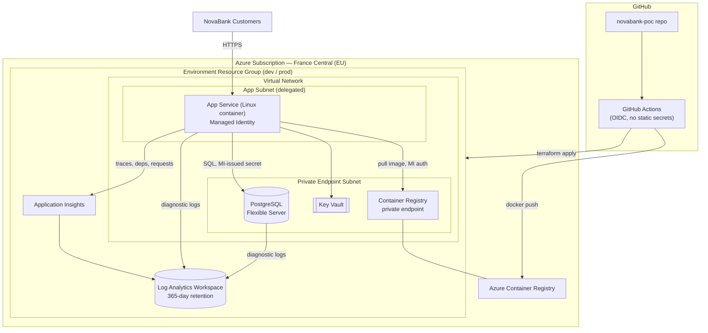

# NovaBank Cloud Foundation — Proof of Concept

A minimal, production-grounded Azure landing for NovaBank's customer portal API: containerized compute, a managed PostgreSQL database, and centralized logging — deployed repeatably via Terraform and GitHub Actions across **dev** and **prod** environments.

> Full business rationale, decisions, and trade-offs: [`docs/architecture-summary.md`](./docs/architecture-summary.md) · Assumptions: [`docs/assumptions.md`](./docs/assumptions.md)

---

## 1. High-Level Design

NovaBank's current portal runs as a single VM with a co-located PostgreSQL database and file-based logging — no environment separation, no automation, no central audit trail. This repository implements the first cloud step: an Azure PaaS footprint that keeps the same application and database engine, removes manual deployment, and adds centralized, retained logging for audit and incident response.



**Core building blocks:**

| Layer          | Azure Service                                   | Purpose                                                                       |
| -------------- | ----------------------------------------------- | ----------------------------------------------------------------------------- |
| Compute        | App Service (Linux, container)                  | Hosts the FastAPI application; managed patching, TLS, autoscale-ready         |
| Image registry | Azure Container Registry (Premium)              | Stores the API container image; pulled via managed identity                   |
| Data           | Azure Database for PostgreSQL – Flexible Server | Drop-in replacement for the on-prem database; zone-redundant HA in prod       |
| Secrets        | Azure Key Vault                                 | Database credentials and application secrets                                  |
| Identity       | User-Assigned Managed Identity                  | Passwordless access from App Service to ACR, Key Vault, PostgreSQL            |
| Observability  | Log Analytics Workspace + Application Insights  | Central application + infrastructure logs, 365-day retention for audit        |
| Network        | Virtual Network, 2 subnets, NSG                 | Isolates data-plane services behind private endpoints; only the app is public |
| Delivery       | GitHub Actions (OIDC) + Terraform               | Repeatable, auditable, click-ops-free deployments                             |

Two environments — **dev** and **prod** — are deployed from the same Terraform module with environment-specific sizing and network exposure (see [Key Decisions & Trade-offs](./docs/architecture-summary.md#3-key-decisions--trade-offs)).

## 2. Repository Structure

```
novabank-poc/
├── docs/                     # Written deliverables
│   ├── assignment.md             # Original assessment brief
│   ├── architecture-summary.md   # Business context, direction, diagram, decisions, 6D alignment
│   └── assumptions.md            # Explicit assumptions behind the design
│
├── src/
│   └── api/                  # NovaBank customer portal API (FastAPI + PostgreSQL)
│       ├── main.py               # API routes (health check, items CRUD)
│       ├── database.py           # PostgreSQL connection handling
│       ├── requirements.txt      # Python dependencies
│       ├── Dockerfile            # Container image definition
│       └── README.md             # How to run/build the API locally
│
├── iac/                      # Infrastructure as Code (Terraform)
│   ├── modules/
│   │   └── nb-api/               # Reusable module: RG, VNet/NSG, App Service + Plan,
│   │       │                     # ACR, PostgreSQL Flexible Server, Key Vault,
│   │       │                     # Log Analytics + App Insights, private DNS zones
│   │       ├── main.tf, network.tf, monitor.tf, private_dns_zones.tf
│   │       ├── local.tf, var.tf, output.tf, provider.tf
│   │       └── README.md         # Auto-generated (terraform-docs): inputs/outputs/resources
│   │
│   └── instances/
│       └── frc/                  # "France Central" deployable root module
│           ├── main.tf               # Instantiates the nb-api module
│           ├── provider.tf           # Provider + remote state backend config
│           ├── var.tf                # Instance-level variable declarations
│           ├── dev/
│           │   ├── dev.tfvars            # Dev-specific values (SKUs, address space, names)
│           │   └── dev.tfbackend         # Dev remote state backend config
│           └── prod/
│               ├── prod.tfvars           # Prod-specific values
│               └── prod.tfbackend        # Prod remote state backend config
│
├── .github/
│   └── workflows/
│       ├── build-api-acr.yml     # Builds & pushes the API container image to ACR
│       ├── run-tf-plan.yml       # Terraform plan on PR (OIDC login, no stored secrets)
│       └── run-tf-apply.yml      # Terraform apply on merge to main
│
├── .gitignore
└── README.md                 # You are here
```

> `ai/` (AI helper + README) and `demo/README.md` (deployment/test walkthrough) are additional deliverables tracked per the assignment's submission guidelines and are added alongside the PoC as they are completed.

### Infrastructure design notes

- **Module vs. instance split**: `iac/modules/nb-api` is a self-contained, reusable Terraform module (documented via `terraform-docs` in its own `README.md`). `iac/instances/frc` is the deployable root that wires the module to a specific region/subscription and supplies per-environment `.tfvars` + `.tfbackend` files — so `dev` and `prod` share identical logic but isolated state and sizing.
- **State isolation**: each environment has its own remote state (`*.tfbackend`), preventing a dev change from ever touching prod state.
- **No click-ops**: every resource is created through `terraform plan`/`apply`, invoked locally or via the GitHub Actions workflows below.

### CI/CD workflows

| Workflow            | Trigger                                                        | What it does                                                                                                              |
| ------------------- | -------------------------------------------------------------- | ------------------------------------------------------------------------------------------------------------------------- |
| `build-api-acr.yml` | Push to `main` (changes under `src/api/**`) or manual dispatch | Builds the API Docker image and pushes it to the target environment's ACR                                                 |
| `run-tf-plan.yml`   | Pull request to `main`, or manual dispatch                     | Authenticates via Azure OIDC, runs `terraform init`/`plan` against the selected environment, surfaces the diff for review |
| `run-tf-apply.yml`  | Push to `main`, or manual dispatch                             | Authenticates via Azure OIDC, runs `terraform init`/`plan`/`apply` to deploy the reviewed change                          |

All workflows authenticate to Azure using **federated OIDC credentials** (`azure/login`) — no long-lived cloud secrets are stored in GitHub.

## 3. Getting Started

Prerequisites: Terraform `>= 1.15.8, < 2.0.0`, Azure CLI, Docker, and an Azure subscription with permissions to create the resources above.

```powershell
# 1. Deploy the infrastructure for an environment (dev shown)
cd iac/instances/frc
terraform init -backend-config="dev/dev.tfbackend"
terraform plan  -var-file="dev/dev.tfvars"
terraform apply -var-file="dev/dev.tfvars"

# 2. Build and push the API image to the environment's ACR
docker build -t novabank-api:v1.0.0 -f src/api/Dockerfile src/api
az acr login --name devnbapifrcacr
docker push devnbapifrcacr.azurecr.io/novabank-api:v1.0.0
```

In practice, both steps are automated by the GitHub Actions workflows above once changes land on `main`.

## 4. Documentation Index

| Document                                                         | Contents                                                                                                     |
| ---------------------------------------------------------------- | ------------------------------------------------------------------------------------------------------------ |
| [`docs/architecture-summary.md`](./docs/architecture-summary.md) | Business context, proposed direction, diagram, decisions & trade-offs, risks, 6D model alignment, next steps |
| [`docs/assumptions.md`](./docs/assumptions.md)                   | Explicit assumptions on application, networking, environments, identity, and cost                            |
| [`iac/modules/nb-api/README.md`](./iac/modules/nb-api/README.md) | Auto-generated Terraform reference: requirements, providers, resources, inputs, outputs                      |
| [`src/api/README.md`](./src/api/README.md)                       | Running and building the API locally                                                                         |
