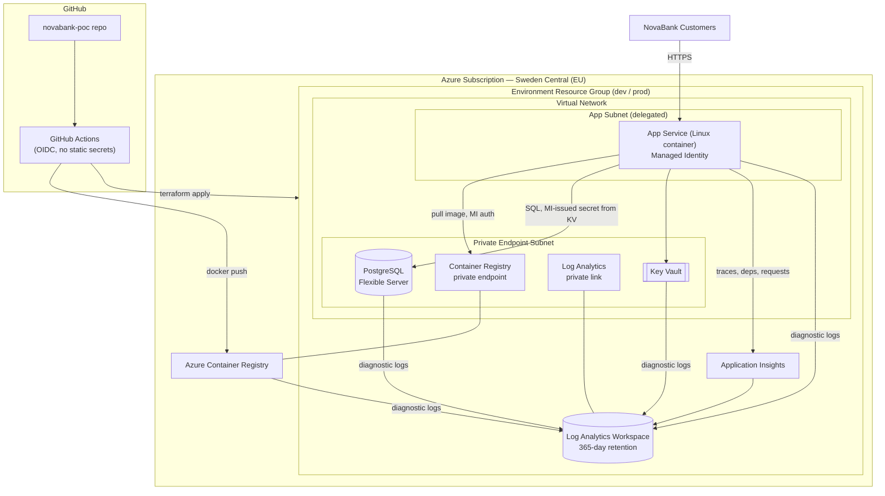

- [NovaBank Cloud Foundation — Architecture Summary](#novabank-cloud-foundation--architecture-summary)
  - [1. Business Context \& Objectives](#1-business-context--objectives)
  - [2. Proposed Direction](#2-proposed-direction)
    - [Architecture Diagram](#architecture-diagram)
  - [3. Key Decisions \& Trade-offs](#3-key-decisions--trade-offs)
  - [4. Assumptions \& Risks](#4-assumptions--risks)
  - [5. Alignment with CloudNation's 6D Model](#5-alignment-with-cloudnations-6d-model)
  - [6. Cost Posture](#6-cost-posture)
  - [7. Next Steps](#7-next-steps)

# NovaBank Cloud Foundation — Architecture Summary

**Prepared for:** NovaBank CTO & Head of Engineering
**Prepared by:** CloudNation Consulting
**Date:** 7 August 2026

---

## 1. Business Context & Objectives

NovaBank runs a customer portal on a single on-premises VM with a local PostgreSQL database and file-based logging. There is no environment separation, no automated deployment, and no central audit trail — a material risk for a regulated financial institution.

NovaBank asked CloudNation for a **low-risk first step** into the public cloud that:

- Separates **dev** and **prod**, with room to add a third stage (e.g. test/staging) later.
- Deploys **repeatably**, without click-ops.
- Provides **central, retained logging** for application and infrastructure events (audit + incident response).
- Keeps the platform **simple** — no Kubernetes, no multi-region active-active, no service mesh.
- Is **cost-defensible** to leadership, with a clear scaling path.

**Constraints driving the design:** EU data residency, availability ≥ 99.9%, RPO ≤ 1h / RTO ≤ 4h, ≥ 12 months centralized, access-restricted log retention, and a regulated-industry audit posture.

## 2. Proposed Direction

We recommend **Microsoft Azure**, using a **PaaS-first "modernize-while-moving" pattern** rather than a VM lift-and-shift:

- **Azure App Service (Linux, container-based)** hosts the existing API packaged as a Docker image — minimal code change, but we gain managed patching, scaling, and TLS.
- **Azure Container Registry (Premium)** stores the image, pulled by App Service via managed identity (no credentials in config).
- **Azure Database for PostgreSQL – Flexible Server** replaces the on-prem database, keeping the same engine (zero migration re-write) with automated backups, and zone-redundant HA in prod.
- **Azure Key Vault** holds database credentials and secrets, accessed via managed identity.
- **Log Analytics Workspace + Application Insights** (365-day retention) centralize application traces, dependency calls, and resource diagnostic logs — satisfying the ≥ 12-month audit requirement in one place.
- **Virtual network with two subnets** (private-endpoint subnet + delegated app subnet) and an **NSG** keep the database, registry, key vault and log workspace off the public internet in prod; only the App Service exposes an HTTPS endpoint.
- **Terraform**, structured as a reusable `nb-api` module instantiated per environment (`dev`, `prod`) with separate state backends and `.tfvars`, gives repeatable, reviewable infrastructure changes.
- **GitHub Actions** (OIDC federated login, no stored cloud secrets) builds/pushes the container image and runs `terraform plan`/`apply` — deployments are triggered from Git, not consoles.
- Region: **Sweden Central**, an EU Azure region, for data residency.

This is deliberately a **single-region, PaaS-only** footprint. It is not yet a full landing zone (no Azure Policy, hub-spoke networking, or multi-subscription governance) — that is intentionally deferred; see [Next Steps](#7-next-steps).

### Architecture Diagram

## 3. Key Decisions & Trade-offs

| Decision                                                                                         | Why                                                                                      | Trade-off accepted                                                                     |
| ------------------------------------------------------------------------------------------------ | ---------------------------------------------------------------------------------------- | -------------------------------------------------------------------------------------- |
| App Service (container) instead of AKS/Container Apps                                            | Simplest managed compute for a single API; no orchestration to operate                   | Less flexible than Kubernetes if the app decomposes into many services later           |
| Keep PostgreSQL engine (Flexible Server) instead of switching to Cosmos DB / managed alternative | Zero data-model rewrite; fastest, lowest-risk migration path                             | Vertical scaling ceiling vs. a distributed database; acceptable at current scale       |
| Environment-scoped resource groups + Terraform module reuse                                      | One reviewed module, consistent dev/prod, isolated blast radius per environment          | Slight duplication of variables per environment `.tfvars`                              |
| Private endpoints for data/secrets/registry, public endpoint only on App Service                 | Balances "simple to reach" with "don't expose the database/secrets"                      | App Service itself still public in dev for faster iteration (see below)                |
| `public_network_access_enabled = true` in **dev only**, locked down in **prod**                  | Cheaper, faster inner-loop testing without a VPN/bastion in the non-critical environment | Dev is not representative of prod's network posture; must not hold real/regulated data |
| Application Insights + Log Analytics, 365-day retention                                          | Meets the ≥ 12-month centralized audit requirement in a single managed service           | Log volume cost grows with traffic; needs a retention/archival review at scale         |
| Zone-redundant HA + geo-redundant backup in prod only; single-zone, no HA in dev                 | Meets 99.9% availability / RPO ≤ 1h / RTO ≤ 4h target in prod while keeping dev cheap    | Dev has no HA — acceptable, dev is not customer-facing                                 |
| GitHub Actions with OIDC (`azure/login`) instead of long-lived service principal secrets         | Removes a stored credential attack surface                                               | Ties CI trust configuration to GitHub's OIDC issuer — a one-time setup dependency      |
| No hub-spoke / landing zone / Azure Policy yet                                                   | Avoids over-engineering the first step, per the assignment's intent                      | Governance, network peering to a future hub, and policy-as-code are follow-up work     |

## 4. Assumptions & Risks

Full assumption list: [`assumptions.md`](./assumptions.md).

| Risk                                                          | Impact                                                     | Mitigation in this PoC / next step                                                                                                    |
| ------------------------------------------------------------- | ---------------------------------------------------------- | ------------------------------------------------------------------------------------------------------------------------------------- |
| Dev environment has public network access enabled             | Data exposure if real data is used in dev                  | Keep dev seeded with synthetic data only; tighten before any production-like data is used                                             |
| Single Azure region (Sweden Central)                          | No cross-region disaster recovery                          | RTO ≤ 4h is met via backups/HA within-region for this first step; multi-region DR is a phase-2 decision once volumes justify the cost |
| No WAF / Front Door in front of App Service                   | Direct exposure to L7 attacks                              | App Service platform provides TLS + basic protections now; add Azure Front Door/WAF once the API is customer-facing at scale          |
| Secrets duplicated between App Service settings and Key Vault | Slight redundancy, potential drift                         | Move fully to Key Vault references in App Service settings as a follow-up hardening task                                              |
| No formal landing zone / policy guardrails                    | Config drift or non-compliant resources possible over time | Introduce Azure Policy + management group structure once a second workload joins the subscription                                     |

## 5. Alignment with CloudNation's 6D Model

This engagement covers the first pass of CloudNation's **[6D Model](https://www.cloudnation.nl/en/inspiration/blogs/moving-to-the-cloud-how-to-structure-a-successful-migration)**:

| 6D Phase                  | What we did in this assessment                                                                                                                                                                                   |
| ------------------------- | ---------------------------------------------------------------------------------------------------------------------------------------------------------------------------------------------------------------- |
| **Discover**              | Reviewed the current single-VM API, on-prem PostgreSQL, file-only logging, and single-environment setup; captured constraints (EU residency, 99.9%/RPO/RTO, ≥12-month audit logs).                               |
| **Define & Design**       | Chose Azure PaaS over lift-and-shift or Kubernetes; designed the dev/prod split, network/private-endpoint boundary, and centralized logging model documented above.                                              |
| **Develop**               | Built the Terraform `nb-api` module and per-environment instances; containerized the existing API without a data-model rewrite.                                                                                  |
| **Deploy**                | Automated deployment via GitHub Actions (OIDC login, image build/push, `terraform plan`/`apply`) — no manual console steps.                                                                                      |
| **Delivery (continuous)** | Log Analytics + Application Insights give NovaBank the operational visibility to run day-2 operations; cost, HA tier, and network posture are designed to evolve (see Next Steps) rather than being final state. |

## 6. Cost Posture

Both environments use small, right-sized SKUs (App Service `P0v3`, PostgreSQL `B_Standard_B1ms` in dev / `GP_Standard_D2s_v3` in prod) and Premium ACR/Key Vault only where private networking requires it. There is no over-provisioning for scale NovaBank does not yet have; the design's cost lever is **tier upgrades**, not architectural rewrites, when volume grows.

## 7. Next Steps

With more time, we would prioritize, in order:

1. **Move App Service behind a private endpoint / VNet-only ingress** with Azure Front Door + WAF for controlled public exposure.
2. **Introduce a lightweight landing zone**: management group, Azure Policy for tagging/region/SKU guardrails, and a hub-spoke network if a second workload is planned.
3. **Harden secret handling**: App Service Key Vault references instead of app settings; rotate the PostgreSQL admin credential automatically.
4. **Add a CI test/quality gate** (lint, unit tests, `terraform validate`/`plan` gating) before `apply` on `main`.
5. **Formal DR test**: validate the documented RTO ≤ 4h / RPO ≤ 1h target with an actual restore drill, and decide if multi-region is warranted.
6. **AI Ops helpers** (see `/ai`): extend the log-insights helper into a scheduled summarizer feeding incident reviews.
